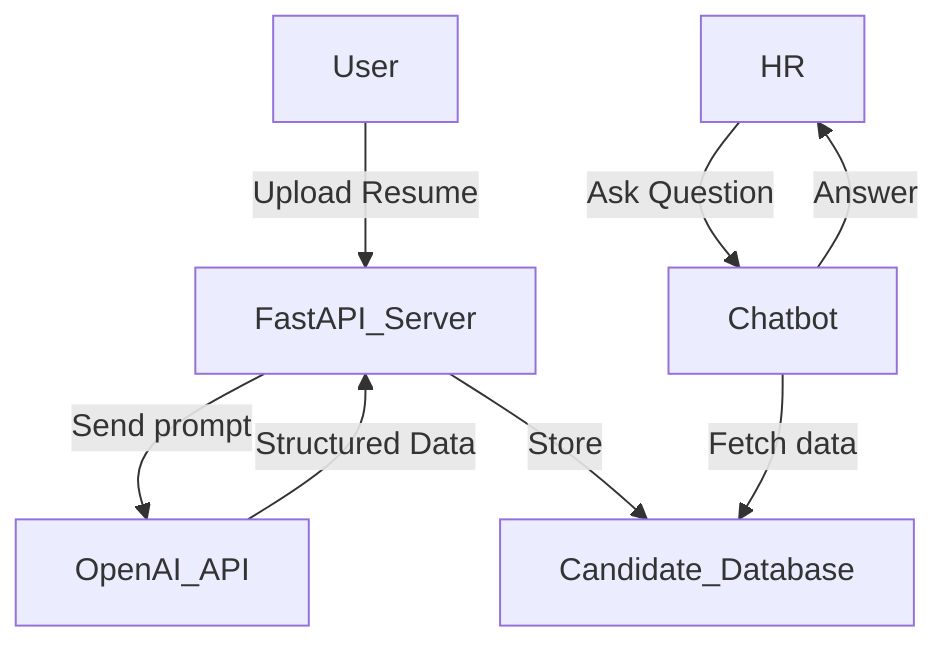

# 📄 SmartHire AI

Welcome to the **SmartHire AI** — an AI-powered backend service that extracts structured information from uploaded resumes using **LLMs** (Large Language Models) and helps HR teams find the best candidates via a chatbot.

---

## Project Overview

This project provides:
- An **API** to upload resume files (PDF or text).
- **LLM** integration to intelligently extract fields like Name, Email, Skills, Work Experience, etc.
- An **HR Chatbot** that answers questions like:
  - "Who is the best Python developer?"
  - "Rank candidates for an AI Engineer role."

⚡ Built with **FastAPI**, **OpenAI GPT-3.5**, and **Python 3.9+**.

---

## 🛠️ Technology Stack

- Python 3.9+
- FastAPI
- OpenAI API (GPT-3.5-turbo)
- Pydantic
- Uvicorn (for local server)
- python-dotenv (for environment variables)

---

## 📦 Project Structure

```
Resume-Parser-HR-Chatbot/
├── main.py
├── services/
│   ├── utils.py
│   └── services.py
├── requirements.txt
├── README.md
├── .gitignore
└── .env  (Not pushed to GitHub)
```

---

## ⚙️ Setup Instructions

Follow these steps to run the project locally:

### 1. Clone the repository

```bash
git clone https://github.com/umeshyadav7988/Resume-Parser---HR-Chatbot.git
cd Resume-Parser---HR-Chatbot
```

### 2. Create & activate a virtual environment (optional but recommended)

```bash
python -m venv venv
source venv/bin/activate   # for Linux/Mac
venv\Scripts\activate      # for Windows
```

### 3. Install dependencies

```bash
pip install -r requirements.txt
```

### 4. Setup `.env` file

Create a `.env` file in the project root with this content:

```env
OPENAI_API_KEY=your-openai-api-key-here
```

(Replace `your-openai-api-key-here` with your real OpenAI secret key.)

### 5. Run the FastAPI server

```bash
uvicorn main:app --reload
```

Server will start at:  
`http://127.0.0.1:8000`

---

## 🧪 API Endpoints

### 1. Upload Resume

`POST /upload_resume/`

- **Request**: `multipart/form-data` with a resume file (PDF or text).
- **Response**: Parsed structured data.

Example using `curl`:

```bash
curl -X 'POST' \
  'http://127.0.0.1:8000/upload_resume/' \
  -H 'accept: application/json' \
  -H 'Content-Type: multipart/form-data' \
  -F 'file=@your_resume.pdf'
```

---

### 2. Chatbot Ask Question

`POST /ask_chatbot/`

- **Request**: JSON with a `question`.
- **Response**: Answer based on parsed candidate data.

Example:

```bash
curl -X 'POST' \
  'http://127.0.0.1:8000/ask_chatbot/' \
  -H 'accept: application/json' \
  -H 'Content-Type: application/json' \
  -d '{"question": "Who has the strongest Python skills?"}'
```

---

### 3. Welcome Route

`GET /`

- Basic welcome message and instructions.

---

## 🛡️ Assumptions & Limitations

- Resume file is expected in **text-readable format** (PDF or `.txt`).
- Currently uses OpenAI's GPT-3.5-turbo model.
- No frontend is included — only backend APIs.
- Minimal error handling for invalid file formats.
- Only basic in-memory candidate storage (no database).

---

## 🎯 Future Improvements

- Add database integration (PostgreSQL, MongoDB).
- Support uploading multiple resumes at once.
- Improve file format parsing (Docx, Scanned PDFs).
- Add authentication & authorization for API endpoints.
- Deploy on AWS / Azure with scalable architecture.
- Fine-tune a custom LLM model for better extraction.

---

## 📸 Demo

](https://github.com/user-attachments/assets/42a39559-b9c0-43db-a5a0-f54303724014)
)


---

## 🤝 Author

- GitHub: [umeshyadav7988](https://github.com/umeshyadav7988)
- Email: [umeshyadav7988@gmail.com](mailto:umeshyadav7988@gmail.com)

---

# 📈 AI Architecture Diagram



---


